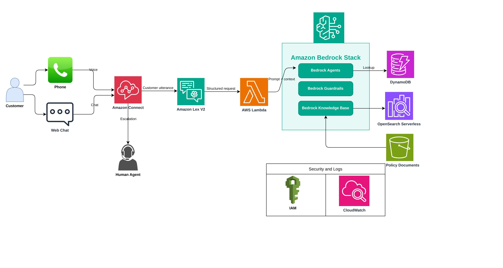
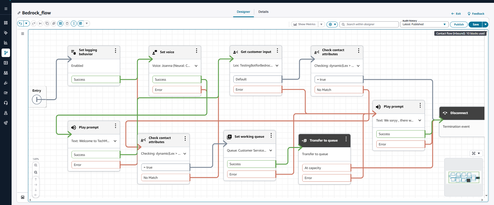
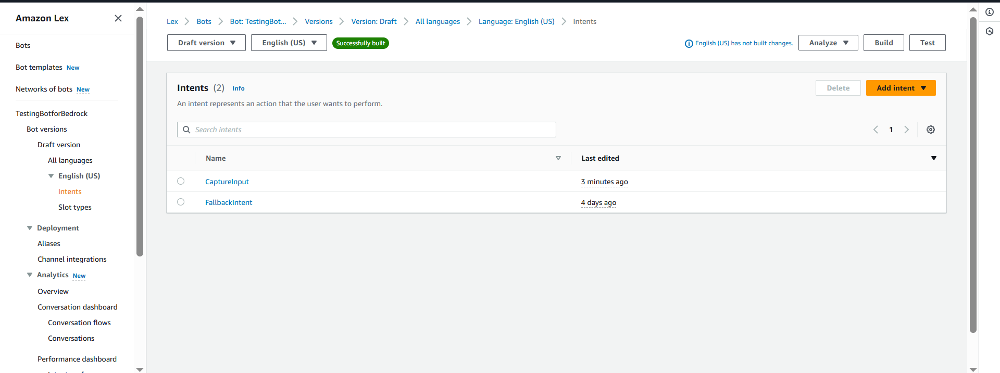
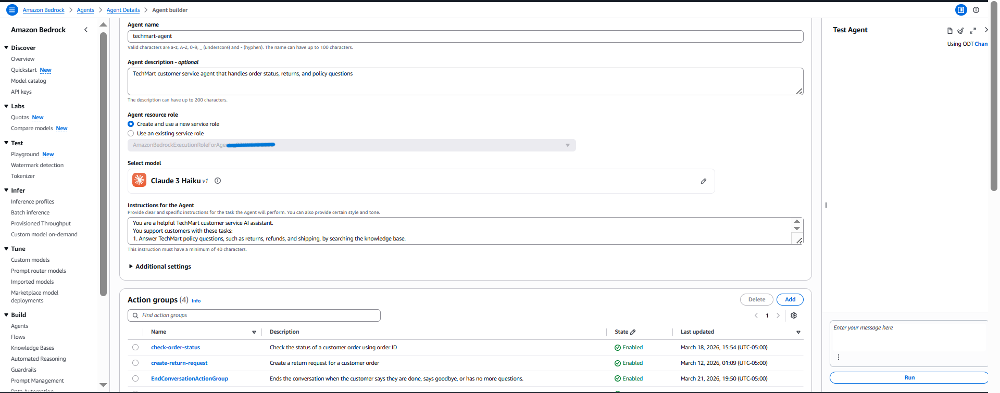
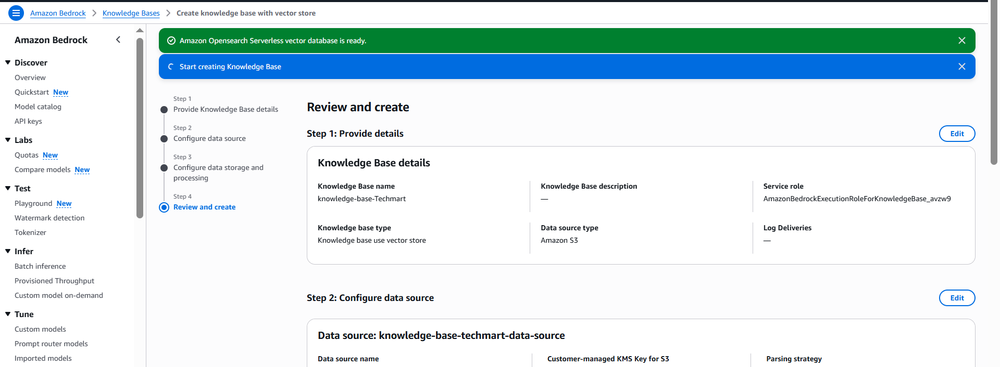
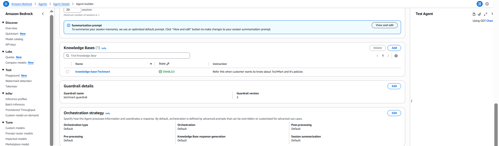
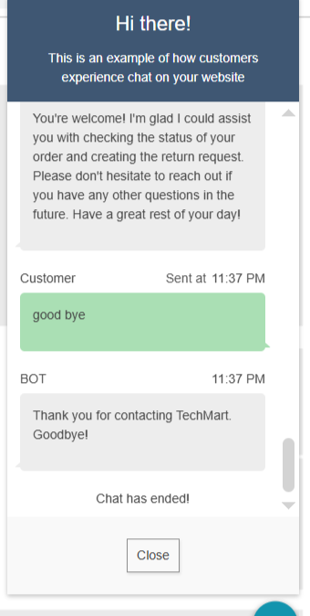

# Amazon Connect Bedrock Contact Center

> Production-style AI contact center architecture built with Amazon Connect, Amazon Lex V2, AWS Lambda, Amazon Bedrock Agents, DynamoDB, and AWS Knowledge Bases for voice and chat customer support automation.


---

## Overview

This project demonstrates a production-style AI-powered contact center built on AWS using Amazon Connect, Amazon Lex V2, AWS Lambda, Amazon Bedrock Agents, DynamoDB, and a Knowledge Base. It supports both voice and chat interactions and is designed to automate common customer support workflows such as answering policy questions, checking order status, supporting return-related conversations, transferring users to a live agent, and ending the conversation cleanly when the user is done.

The solution uses Amazon Connect as the customer interaction layer, Amazon Lex V2 as the conversational bridge, AWS Lambda as the orchestration layer, and Amazon Bedrock as the intelligence engine that drives reasoning, workflow decisions, and action handling. The result is a serverless, event-driven support system that combines conversational AI with real contact-center routing logic.

---

## Key Architecture Highlights

- AI-powered customer support for both voice and chat
- Amazon Bedrock Agent used as the primary reasoning and orchestration layer
- Amazon Connect flow routing driven by Lex session attributes
- AWS Lambda bridge between Lex and Bedrock Agent Runtime
- DynamoDB-backed order and return workflows
- Bedrock action groups for escalation and end-conversation handling
- Bedrock Knowledge Base for policy and general company information
- Voice interruption support for live call experience
- Fully serverless architecture using AWS managed services

---

## Table of Contents

- [Business Problem](#business-problem)
- [Architecture](#architecture)
- [Features](#features)
- [Tech Stack](#tech-stack)
- [Repository Structure](#repository-structure)
- [How It Works](#how-it-works)
- [Example Customer Interaction](#example-customer-interaction)
- [Knowledge Base](#knowledge-base)
- [Guardrails](#guardrails)
- [Challenges and Solutions](#challenges-and-solutions)
- [Production Readiness](#production-readiness)
- [Future Enhancements](#future-enhancements)
- [What I Learned](#what-i-learned)

---

## Business Problem

Customer support teams spend a large amount of time handling repetitive questions such as return policies, refund timelines, shipping details, order tracking, and basic order management. While these interactions are common, they still require a consistent, fast, and reliable customer experience across both voice and chat channels.

This solution automates those tier-1 support journeys by combining Amazon Connect with Amazon Bedrock Agents. Instead of building a rigid intent-only bot, the project uses Bedrock as the reasoning engine so the assistant can respond more naturally, decide when to ask follow-up questions, trigger backend workflows, escalate to a human agent, and end the conversation gracefully when appropriate.

---

## Architecture

This project follows a serverless contact center architecture built entirely on AWS managed services.

Amazon Connect serves as the entry point for customer calls and chats and is responsible for managing the overall contact flow. Amazon Lex V2 receives customer utterances from Connect and invokes an AWS Lambda function through the dialog code hook. That Lambda function acts as the central integration layer of the solution. It receives the Lex event, extracts the user message and session context, invokes the Amazon Bedrock Agent using the Bedrock Agent Runtime API, and converts the Bedrock response into a valid Lex response with session attributes that Amazon Connect can use for routing decisions.

Amazon Bedrock is the main intelligence layer in the system. The Bedrock Agent is configured with Claude Haiku, guardrails, action groups, and business instructions so it can answer support questions, gather missing information such as order ID or return reason, trigger escalation when a customer asks for a human, and signal when the conversation should end. Backend operational data such as orders and return workflows are handled through DynamoDB-backed tool paths, while broader policy and company information is supplied through a Knowledge Base.

At runtime, the interaction flows through the services in this order: Amazon Connect receives the customer input, Lex passes the input to Lambda, Lambda invokes the Bedrock Agent, Bedrock decides what to do and returns text or an action signal, Lambda translates that into a Lex response, and Connect reads the returned session attributes to determine whether the contact should continue, transfer to a queue, or disconnect.

---

### Amazon Connect Flow


---

### Lex Bot Configuration


---

### Bedrock Agent Action Group

---

### Knowledge Base Configuration


---

### Guardrails in Bedrock


---

### Connect Test Chat


---

## Features

### Customer Experience
- General support conversations over voice and chat
- Order status lookup with order ID validation
- Return request guidance with reason capture
- Policy and FAQ handling through Knowledge Base
- Transfer to live human agent on request
- Clean conversation termination when customer is done
- Voice interruption support during spoken responses

### AI and Orchestration
- Amazon Bedrock Agent used as the primary decision-making layer
- Action groups for escalation and end-conversation handling
- Guardrails for safer, more controlled responses
- Short-response prompt tuning for contact-center usability
- Session-aware conversations using shared session IDs between Lex and Bedrock

### Operations
- CloudWatch logging for Lambda and runtime debugging
- Contact flow routing based on Lex session attributes
- Voice and chat channel support in the same architecture
- Knowledge Base-backed policy and company information retrieval

---

## Tech Stack

### AWS Services
- Amazon Connect
- Amazon Lex V2
- AWS Lambda
- Amazon Bedrock Agents
- Amazon Bedrock Agent Runtime
- Amazon Bedrock Guardrails
- Amazon Bedrock Knowledge Bases
- Amazon DynamoDB
- Amazon S3
- OpenSearch Serverless
- Amazon Polly
- Amazon CloudWatch
- AWS IAM

### Models and AI Configuration
- Claude Haiku as the Bedrock Agent model
- Titan Text Embeddings V2 for Knowledge Base embeddings

---

## Repository Structure

```text
amazon-connect-bedrock-contact-center/
│
├── README.md
├── LICENSE
├── .gitignore
│
├── lambda/
│   └── techmart-connect-bridge.py
│
├── dynamodb/
│   └── sample-data.json
│
├── connect/
│   └── contact-flow-notes.md
│
├── docs/
│   ├── images/
│   │   ├── amazon-connect-flow.png
│   │   ├── architecture-diagram.jpg
│   │   ├── bedrock-agent-action-group.png
│   │   ├── connect_test_chat.png
│   │   ├── kb-guardrail-in-bedrock.png
│   │   ├── knowledge-base-config.png
│   │   └── lex-bot-config.png
│   ├── setup-guide.md
│   └── testing-checklist.md
```

## How It Works

When a customer starts a voice call or chat session, the interaction begins in Amazon Connect. The contact flow plays the greeting and sends the customer’s input to Amazon Lex V2 through the Get customer input block. Lex does not perform the main support reasoning in this project; instead, it serves as the input layer and invokes Lambda with the user’s utterance and session state.

The Lambda function acts as the orchestration bridge between Lex and Bedrock. It takes the user message, reuses the Lex session ID as the Bedrock session ID, and calls the Bedrock Agent through invoke_agent. The Bedrock Agent then decides whether to answer directly, ask for missing information, trigger a business operation such as order lookup, escalate to a live agent, or end the conversation. If the response is a normal support answer, Lambda packages that answer into a valid Lex V2 response and returns it with ElicitIntent so the conversation can continue. If the agent signals escalation, Lambda returns a Lex response with escalate=true. If the agent signals end conversation, Lambda returns endConversation=true.

Amazon Connect then reads those session attributes from Lex. If endConversation=true, the contact flow routes to a disconnect block. If escalate=true, the flow routes to the configured working queue and transfers the contact to a live agent. If neither is true, the flow loops back to Get customer input and the conversation continues naturally. This design makes Bedrock the actual reasoning engine, while Connect handles routing and Lex handles conversational transport.

## Example Customer Interaction
Order Status

Customer: “I need help with my order.”
Assistant: “Sure, I can help with that. Please provide your order ID.”
Customer: “ORD10001”
Assistant: “Your order ORD10001 has been shipped and is currently in transit.”

Agent Escalation

Customer: “Can you transfer me to a human agent?”
Assistant: “Sure, I’ll connect you to a support agent now.”

End Conversation

Customer: “That’s all, thank you.”
Assistant: “You’re welcome. Have a great day.”

## Knowledge Base

The Knowledge Base was designed to support broader support and company-related questions, including return policy, refund timelines, shipping details, order cancellation rules, loyalty program information, and general company information such as why customers should buy from the brand. Titan Text Embeddings V2 was used during the knowledge-base setup, and vector storage was explored with OpenSearch Serverless and Amazon S3 Vectors.

## Guardrails

Bedrock Guardrails were configured to keep the assistant focused on company support topics, reduce unsafe or off-topic behavior, and improve response consistency. Additional prompt constraints were added so the assistant stays professional, avoids revealing model identity, and keeps answers short and practical for contact-center interactions.

## Challenges and Solutions

One of the main challenges in this project was making operational actions work reliably in a conversational flow. Plain-text responses such as “Goodbye” or “I’ll transfer you” were not enough on their own, because Amazon Connect requires explicit machine-readable session attributes to know whether to disconnect or route to a queue. This was solved by using Bedrock action groups and having Lambda translate those actions into Lex session attributes such as endConversation and escalate.

Another challenge was making the architecture work consistently across both chat and voice channels. Voice required additional tuning for interruption behavior, shorter responses, and contact-flow routing. There were also several integration issues around Lex response formatting, Lambda syntax/runtime errors, Bedrock action invocation modes, Knowledge Base vector-store setup, and cleanup of failed Knowledge Base resources after OpenSearch resources had already been deleted.

## Production Readiness

This project was built and tested as a production-style AWS workflow. It uses managed AWS services end to end, supports both voice and chat, separates orchestration from reasoning, uses explicit routing signals for operational actions, and includes logging and debugging through CloudWatch. The design is modular enough to be extended with more support workflows, richer backend APIs, analytics, or full infrastructure-as-code in a future version.

## Future Enhancements
Full Infrastructure as Code for Connect, Lex, and Bedrock configuration.  
CI/CD for Lambda, prompts, and knowledge-base document updates.  
Expanded Knowledge Base coverage for broader support use cases  
Additional business workflows such as order cancellation and refund status  
Analytics dashboard for conversation and transfer metrics  
Enhanced prompt tuning for even shorter and faster responses  

## What I Learned

This project provided hands-on experience with how Amazon Connect, Amazon Lex V2, AWS Lambda, and Amazon Bedrock work together in a real contact-center use case. The biggest technical learning was that Bedrock can be used as the true reasoning layer while Lex and Connect act as the transport and routing layers. It also highlighted the importance of session attributes, action-group handling, Bedrock alias/version management, Lambda debugging, Knowledge Base vector-store setup, and voice-specific behavior such as interruption support.
